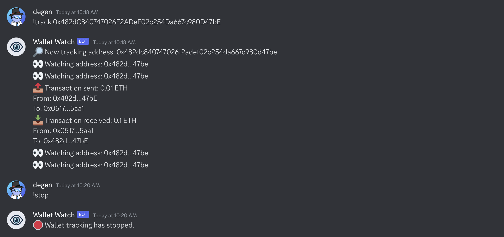
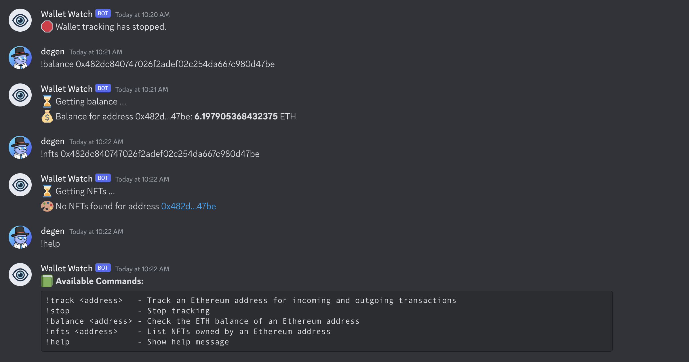
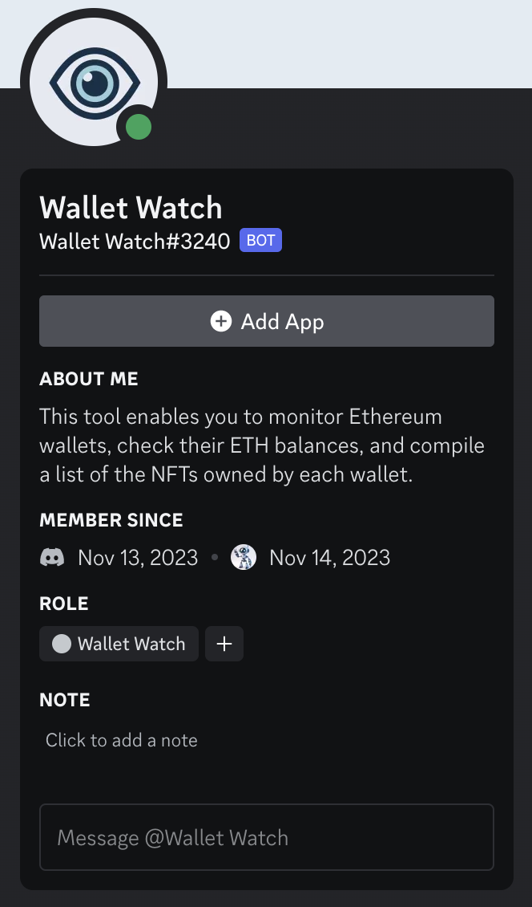

## Wallet Watch Discord Bot

[![TypeScript version][ts-badge]][typescript-5-1]
[![Node.js version][nodejs-badge]][nodejs]
[![APLv2][license-badge]][license]
[![Build Status - GitHub Actions][gha-badge]][gha-ci]

This tool enables you to monitor Ethereum wallets, check their ETH balances, and compile a list of the NFTs owned by each wallet. The bot is crafted for effortless setup and deployment within your preferred environment.

### Screenshots





### Video

[
](https://vimeo.com/884499043?share=copy)

🏃🏽 Instant Value: All basic tools included and configured:

- [TypeScript][typescript] [5.1][typescript-5-1]
- [ESM][esm]
- [ESLint][eslint] with some initial rules recommendation
- [Jest][jest] for fast unit testing and code coverage
- Type definitions for Node.js and Jest
- [Prettier][prettier] to enforce consistent code style
- NPM [scripts](#available-scripts) for common operations
- [EditorConfig][editorconfig] for consistent coding style
- Reproducible environments thanks to [Volta][volta]
- Example configuration for [GitHub Actions][gh-actions]
- Simple example of TypeScript code and unit test

### Prerequisites

- Node.js 18.x or higher
- A Discord bot token
- An Alchemy API key

### Installation

1. Clone the [repository](https://github.com/bullishgopher/wallet-watch-bot) or download the source code.

2. Install dependencies:

```bash
pnpm install
```

### Configuration

Create `.env` in the project directory and add your Discord bot token and Alchemy API key.

```
DISCORD_BOT_TOKEN=
DISCORD_CHANNEL_ID=
ALCHEMY_API_KEY=
```

### Running the Bot

Start the bot:

```bash
pnpm start
```

The bot should now be running and connected to your Discord server. You should see a message in the configured channel indicating that the Wallet Watch Bot is online.

### Usage

The bot has the following commands:

```
!track <address>: Track an Ethereum address for incoming and outgoing transactions.

!balance <address>: Check the Ether balance of an Ethereum address.

!nfts <address>: List NFTs owned by an Ethereum address.

!help: Show a help message with the available commands.
```

### Available Scripts

- `clean` - remove coverage data, Jest cache and transpiled files,
- `prebuild` - lint source files and tests before building,
- `build` - transpile TypeScript to ES6,
- `build:watch` - interactive watch mode to automatically transpile source files,
- `lint` - lint source files and tests,
- `prettier` - reformat files,
- `test` - run tests,
- `test:watch` - interactive watch mode to automatically re-run tests

### Contributing

Feel free to open issues or submit pull requests if you find any bugs or have suggestions for improvements.

### License

Licensed under the APLv2. See the [LICENSE](https://github.com/bullishgopher/wallet-watch-bot/blob/main/LICENSE) file for details.

[ts-badge]: https://img.shields.io/badge/TypeScript-5.1-blue.svg
[nodejs-badge]: https://img.shields.io/badge/Node.js->=%2018.12-blue.svg
[nodejs]: https://nodejs.org/dist/latest-v18.x/docs/api/
[gha-badge]: https://github.com/jsynowiec/node-typescript-boilerplate/actions/workflows/nodejs.yml/badge.svg
[gha-ci]: https://github.com/jsynowiec/node-typescript-boilerplate/actions/workflows/nodejs.yml
[typescript]: https://www.typescriptlang.org/
[typescript-5-1]: https://devblogs.microsoft.com/typescript/announcing-typescript-5-1/
[license-badge]: https://img.shields.io/badge/license-APLv2-blue.svg
[license]: https://github.com/jsynowiec/node-typescript-boilerplate/blob/main/LICENSE
[sponsor-badge]: https://img.shields.io/badge/♥-Sponsor-fc0fb5.svg
[sponsor]: https://github.com/sponsors/jsynowiec
[jest]: https://facebook.github.io/jest/
[eslint]: https://github.com/eslint/eslint
[wiki-js-tests]: https://github.com/jsynowiec/node-typescript-boilerplate/wiki/Unit-tests-in-plain-JavaScript
[prettier]: https://prettier.io
[volta]: https://volta.sh
[volta-getting-started]: https://docs.volta.sh/guide/getting-started
[volta-tomdale]: https://twitter.com/tomdale/status/1162017336699838467?s=20
[gh-actions]: https://github.com/features/actions
[repo-template-action]: https://github.com/jsynowiec/node-typescript-boilerplate/generate
[esm]: https://developer.mozilla.org/en-US/docs/Web/JavaScript/Guide/Modules
[sindresorhus-esm]: https://gist.github.com/sindresorhus/a39789f98801d908bbc7ff3ecc99d99c
[nodejs-esm]: https://nodejs.org/docs/latest-v16.x/api/esm.html
[ts47-esm]: https://devblogs.microsoft.com/typescript/announcing-typescript-5-1/#esm-nodejs
[editorconfig]: https://editorconfig.org

### Resources

[Discord.js Guide - Frequently asked Questions](https://discordjs.guide/popular-topics/faq.html#legend)

[Discord.js Docs](https://discord.js.org/docs/packages/discord.js/main)

[Node + TypeScript Template](https://github.com/jsynowiec/node-typescript-boilerplate)

[How to Make a Discord Bot: an Overview and Tutorial](https://www.toptal.com/chatbot/how-to-make-a-discord-bot)

[How to make a Discord bot with code in 5 steps](https://autocode.com/guides/how-to-build-a-discord-bot/)
